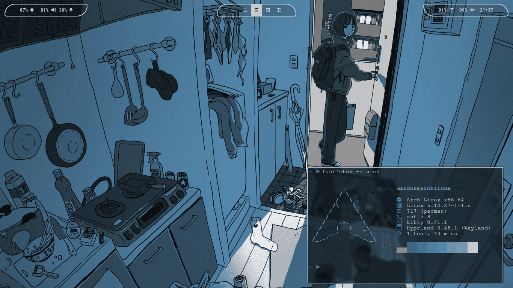

# Cata

Cata is my first rice setup on Linux, built for Arch Linux.
The name is inspired by the beauty and delicacy of a TikTok content creator, whose aesthetic I wanted to reflect in my desktop environment.

This project aims not only to be functional and productive but also to convey a sense of beauty and harmony while working on the system.

## Screenshots

## Features

- Inspired by minimalism and elegance
- Lightweight configuration designed for an efficient workflow
- Perfect for users seeking customization from the ground up

## Acknowledgments

I want to give a special thanks to **ndrewA**, whose dotfiles served as a reference for structuring this project. Without that template, I probably wouldn’t have known where to begin.

- [Reddit post](https://www.reddit.com/r/unixporn/comments/1c33tu6/wallpaper_90_rice_hyprland_btw/)
- [GitHub repository](https://github.com/ndrewA/dotfiles)
